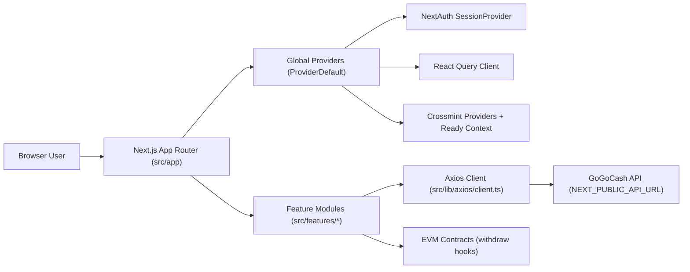
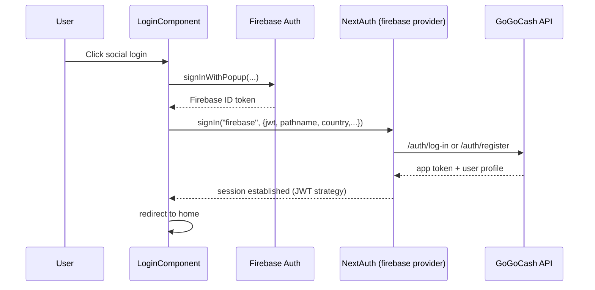

# GoGoCash Web App (Feature: Firebase Login)

This repository contains the GoGoCash frontend built with Next.js App Router. It is a client-heavy application focused on cashback discovery, user profile management, referral and quest features, and wallet withdrawal flows (bank transfer + Web3).

## 1) Architecture At A Glance

### Core architecture decisions

- Framework: Next.js 16 (App Router) with TypeScript.
- Rendering style: mostly client components (`"use client"`) for fast UI interactivity and SDK compatibility.
- Data layer: `@tanstack/react-query` + Axios wrapper with centralized auth token injection.
- Auth session: NextAuth JWT strategy.
- Identity providers:
  - Active: Firebase-based credential flow (`provider id: firebase`) with Google/X/Facebook/Telegram entry points.
  - Integrated but partially legacy: Crossmint provider + context is mounted globally for wallet/subscription integrations.
- i18n: `next-intl` route-based localization (`/en/*`, `/th/*`).
- Web3: `ethers` + MetaMask for on-chain withdrawal transactions.

### High-level runtime graph



## 2) Repository Structure

```text
src/
  app/
    layout.tsx                     # Root HTML shell + ProviderDefault
    [locale]/
      layout.tsx                   # Locale shell + ClientLayoutWrapper
      page.tsx                     # Home
      login/page.tsx
      register/page.tsx
      quest/page.tsx
      shop/page.tsx
      shop/[id]/page.tsx
      category/page.tsx
      category/[name]/page.tsx
      auth/callback/page.tsx       # Telegram/Firebase callback bridge
      (profile)/                   # Auth-protected profile area
        layout.tsx                 # AuthGuard + profile sidebar layout
        profile/*
        wallet/page.tsx
        withdraw/*
        method/*
        favorite/page.tsx
        subscription/page.tsx
    api/
      auth/[...nextauth]/route.ts  # NextAuth endpoint
      countries/route.ts           # REST Countries proxy
      hello/route.ts               # health/demo endpoint

  components/
    layouts/                       # Header/SubHeader/Footer/Profile shell
    auth/                          # Auth guards
    common/                        # Generic UI elements
    icons/

  features/
    auth/ home/ shop/ category/ search/
    profile/ wallet/ transaction/
    quest/ referral/ subscription/

  hooks/
    useFirebaseLogin.ts
    useCrossmintLogin.ts
    useWithdrawWeb3.ts
    useWithdrawMyCashback.ts
    useSafeCrossmint.ts

  lib/
    axios/client.ts                # HTTP client + auth interceptors
    authFirebase.ts                # Active NextAuth config
    auth.ts                        # Legacy Crossmint NextAuth config
    firebaseClient.ts              # Firebase browser setup
    query/queryClient.ts           # React Query defaults
    services/*.ts                  # Domain API wrappers
    crossmint/SettingCrossmint.tsx

  i18n/
    routing.ts navigation.ts request.ts

  interfaces/
    auth.ts offer.ts withdraw.ts ...

  messages/
    en.json th.json jp.json
```

## 3) Runtime Layers In Detail

## 3.1 App Router and Layout Composition

### Root layout
- File: `src/app/layout.tsx`
- Responsibilities:
  - Sets metadata and global CSS.
  - Wraps all pages with `ProviderDefault`.
  - Injects Facebook domain verification meta tag.

### Locale layout
- File: `src/app/[locale]/layout.tsx`
- Responsibilities:
  - Wraps locale routes in `NextIntlClientProvider`.
  - Wraps visible app frame in `ClientLayoutWrapper`.

### Profile route-group layout
- File: `src/app/[locale]/(profile)/layout.tsx`
- Responsibilities:
  - Uses `AuthGuard` to protect profile routes.
  - Applies profile sidebar shell (`SubProfile`).

### Layout gating behavior
- `ClientLayoutWrapper` waits for Crossmint ready signal before rendering Header/SubHeader/Footer.
- This avoids calling Crossmint-dependent hooks before SDK is initialized.

## 3.2 Global Provider Stack

File: `src/providers/ProviderDefault.tsx`

Provider order:

1. `QueryClientProvider`
2. `SessionProvider`
3. `ClientOnly` mount guard
4. `CrossmintReadyProvider`
5. `CrossmintErrorBoundary`
6. `SettingCrossmint` (dynamic import, `ssr: false`)
7. `CrossmintLoginContext`
8. `Toaster`
9. `ReactQueryDevtools`

Why this matters:
- Prevents SSR/hydration issues from SDKs requiring browser globals.
- Ensures one place controls React Query, auth session, and Crossmint readiness.

## 3.3 Authentication Architecture

### Active NextAuth configuration
- Route: `src/app/api/auth/[...nextauth]/route.ts`
- Active options file: `src/lib/authFirebase.ts`

### Provider and credential flow
- NextAuth credential provider id: `firebase`.
- Supported branches in `authorize`:
  - `type === "telegram"`: reads `/user/profile` with provided JWT.
  - Default Firebase social flow:
    - If pathname is `/register` -> calls `/auth/register`.
    - Else -> calls `/auth/log-in`.

### Session/JWT callbacks
- Token stores app-specific identity fields (`_id`, `wallet`, `username`, region/mobile/birthdate/gender, etc.).
- Session maps token fields to `session.user`.
- Session strategy: JWT.

### Frontend login entry points
- `src/features/auth/component/LoginComponent.tsx`
  - Social login buttons use `useFirebaseLogin` for Google/X/Facebook.
  - Telegram OAuth handled via Telegram redirect + callback params.
  - Final sign-in always enters NextAuth through `signIn("firebase", ...)`.

### Axios auth propagation
- File: `src/lib/axios/client.ts`
- Request interceptor:
  - Reads current session with `getSession()`.
  - Adds `Authorization: Bearer <session.user.access_token>`.
- Response interceptor:
  - Auto-signout on token-invalid messages (Firebase token invalid/expired, bad algorithm).

### Crossmint auth notes
- `src/lib/auth.ts` defines `provider id: crossmint` but is not wired in API route currently.
- `useCrossmintLogin.ts` still calls `signIn("crossmint", ...)`, which indicates legacy/in-transition behavior.
- `SettingCrossmint` + Crossmint contexts are still used by parts of the app (for readiness and hosted checkout-related UX).

## 3.4 Data Access Layer

### React Query
- Centralized query client in `src/lib/query/queryClient.ts`.
- Defaults:
  - `refetchOnWindowFocus: false`
  - `refetchOnMount: false`
  - `refetchOnReconnect: false`
  - `staleTime: 0`

### HTTP helpers
- `fetcher` -> GET
- `fetcherPost` -> POST
- `fetcherPut` -> PUT

These wrappers are used directly in feature components and hook-level queries/mutations.

### Service wrappers
- `src/lib/services/auth.ts`
- `src/lib/services/detail.ts`
- `src/lib/services/offer.ts`
- `src/lib/services/withdraw.ts`

Pattern: thin endpoint wrappers around the shared Axios client.

## 3.5 Internationalization Layer

Files:
- `middleware.ts`
- `src/i18n/routing.ts`
- `src/i18n/navigation.ts`
- `src/i18n/request.ts`
- `src/messages/en.json`, `src/messages/th.json`

Behavior:
- Locale-prefixed routing enabled via `next-intl` middleware.
- Active locales in routing: `en`, `th` (default `en` in `src/i18n/routing.ts`).
- Message bundles loaded dynamically from `src/messages/{locale}.json`.

Note:
- `next-intl.config.ts` currently uses a different default locale (`th`) from `src/i18n/routing.ts` (`en`). Keep these aligned to avoid locale drift.

## 3.6 UI/Layout Layer

### Global navigation
- `Header.tsx`: logo, search, category popup, profile bar, locale/country modal.
- `SubHeader.tsx`: quick category links + help link behavior by user region.
- `Footer.tsx` / `FooterMobile.tsx`: desktop/mobile bottom navigation and links.

### Route-protected profile shell
- `SubProfile.tsx` renders left navigation for profile-related pages.
- `AuthGuard.tsx` redirects unauthenticated users to `/login`.

## 4) Feature Modules (What Owns What)

| Module | Main responsibility | Key files |
|---|---|---|
| `auth` | Login/register UI, Telegram + Firebase social entry points | `src/features/auth/component/LoginComponent.tsx`, `src/hooks/useFirebaseLogin.ts` |
| `home` | Landing sections (banner, trending, popular, special categories) | `src/features/home/component/*` |
| `shop` | Offer list, offer detail, deeplink generation, coupons, favorites | `src/features/shop/component/List.tsx`, `ShopDetail.tsx` |
| `category` | Category index and category-specific offer listing | `src/features/category/component/*` |
| `search` | Header search popper with offer lookup | `src/features/search/component/SearchShop.tsx` |
| `profile` | User profile info, phone verification, payout methods, favorites/offers | `src/features/profile/component/*` |
| `wallet` | Withdraw UI and method selection | `src/features/wallet/component/MyWalletWithdraw.tsx` |
| `transaction` | Wallet summary, conversion list, withdraw history | `src/features/transaction/component/WalletTransaction.tsx` |
| `quest` | Ranking, extra-point offers, quest-related shop list | `src/features/quest/component/QuestPage.tsx` |
| `referral` | Referral link sharing and referral activity listing | `src/features/referral/ReferralPage.tsx` |
| `subscription` | Crossmint hosted checkout integration | `src/features/subscription/SubscriptionPage.tsx` |

## 5) API Surface Used By Frontend

Most API calls hit `${NEXT_PUBLIC_API_URL}` via Axios wrappers.

### Auth / user
- `POST /auth/log-in`
- `POST /auth/register`
- `POST /auth/log-in/telegram`
- `GET /auth/check-account-telegram/:telegramId`
- `GET /user/profile`
- `PUT /user/profile`
- `PUT /user/update-country`
- `POST /auth/firebase` (phone verification flow)

### Offers / discovery
- `GET /offer/banner-home`
- `GET /offer/extra`
- `GET /offer/extra-point`
- `GET /offer?category=...&search=...&limit=...&page=...`
- `GET /offer/:id`
- `GET /offer/get-coupon-id/:id`
- `GET /offer/get-category/list`
- `GET /offer/favorite/:page/:limit`
- `POST /offer/favorite/:offer_id`
- `POST /involve/create-affiliate`

### Wallet / withdraw
- `POST /withdraw/check`
- `POST /withdraw/check-my-cashback`
- `POST /withdraw/list-check`
- `GET /withdraw?search=&limit=&page=`
- `POST /withdraw/signature`
- `POST /withdraw`
- `POST /withdraw/bank-transfer`
- `GET /withdraw/methods-list`
- `GET /withdraw/methods/:id`
- `POST /withdraw/methods`
- `PATCH /withdraw/methods/:id`
- `GET /withdraw/banks`

### Quest / referral / points
- `GET /point/check-points/:start/:end`
- `GET /point/my-quest-list/:start/:end`
- `GET /point/referral-list`

### Internal Next.js API routes
- `GET /api/countries` -> proxies REST Countries and sorts by common name.
- `GET /api/hello` -> simple text response.

## 6) Critical User Flows

### 6.1 Login Flow (Google/X/Facebook)



### 6.2 Protected Profile Route Flow

1. User navigates to any route in `src/app/[locale]/(profile)/*`.
2. `AuthGuard` reads `useSession()` status.
3. If unauthenticated -> redirect `/login`.
4. If authenticated -> render profile layout + route content.

### 6.3 Web3 Withdraw Flow

1. Load withdraw summary from `/withdraw/check`.
2. Ensure wallet is connected (MetaMask) and on selected chain.
3. Request backend signature: `POST /withdraw/signature`.
4. Execute on-chain `withdrawCashback(...)` using chain-specific ABI/address.
5. On success, persist withdraw history with `POST /withdraw`.
6. Refresh wallet/check state.

## 7) Environment Variables

## Required for local development

| Variable | Purpose |
|---|---|
| `NEXT_PUBLIC_API_URL` | Base URL for backend API used by Axios client |
| `NEXTAUTH_SECRET` | NextAuth JWT/session signing secret |
| `NEXT_PUBLIC_FIREBASE_API_KEY` | Firebase client SDK |
| `NEXT_PUBLIC_FIREBASE_AUTH_DOMAIN` | Firebase client SDK |
| `NEXT_PUBLIC_FIREBASE_PROJECT_ID` | Firebase client SDK |
| `NEXT_PUBLIC_FIREBASE_APP_ID` | Firebase client SDK |
| `NEXT_PUBLIC_FRONTEND_URL` | Used in Telegram/referral links and redirects |
| `NEXT_PUBLIC_TELEGRAM_BOT_TOKEN` | Telegram OAuth flow (`LoginComponent`) |
| `NEXT_PUBLIC_TELEGRAM_BOT_USERNAME` | Telegram widget (`TelegramLogin`) |
| `NEXT_PUBLIC_CROSSMINT_API_KEY` | Crossmint provider initialization |
| `NEXT_PUBLIC_CROSSMINT_COLLECTION_ID` | Subscription checkout collection locator |

## Required for Web3 withdrawal

| Variable | Purpose |
|---|---|
| `NEXT_PUBLIC_CHAIN_ID_WITHDRAW_POLYGON` | Polygon chain id |
| `NEXT_PUBLIC_CHAIN_ID_WITHDRAW_BNB` | BNB chain id |
| `NEXT_PUBLIC_CHAIN_ID_WITHDRAW_SONIC` | Sonic chain id |
| `NEXT_PUBLIC_CHAIN_ID_WITHDRAW_CELO` | Celo chain id |
| `NEXT_PUBLIC_CONTRACT_WITHDRAW_ADDRESS_POLYGON` | Polygon contract address |
| `NEXT_PUBLIC_CONTRACT_WITHDRAW_ADDRESS_BNB` | BNB contract address |
| `NEXT_PUBLIC_CONTRACT_WITHDRAW_ADDRESS_SONIC` | Sonic contract address |
| `NEXT_PUBLIC_CONTRACT_WITHDRAW_ADDRESS_CELO` | Celo contract address |

## 8) Local Development

### Install

```bash
npm install
```

### Run

```bash
npm run dev
```

### Lint

```bash
npm run lint
```

### Build and start

```bash
npm run build
npm run start
```

## 9) Docker Notes

Current `Dockerfile` uses a multi-stage build:
- Builder installs dependencies and runs `yarn build`.
- Runner starts app via `npm start`.

Make sure lockfile/package manager strategy is consistent in CI/CD (current file mixes `yarn` and `npm` commands).

## 10) Development Playbook (How To Add Features Fast)

1. Add route under `src/app/[locale]/...`.
2. Implement domain UI under `src/features/<domain>/component`.
3. Add/extend TypeScript interfaces in `src/interfaces`.
4. Add API calls using `fetcher`/`fetcherPost`/services in `src/lib/services`.
5. Use React Query for server state and cache keys scoped by domain.
6. If route requires login, place it under `(profile)` or add `AuthGuard`.
7. Add translation keys in `src/messages/en.json` and `src/messages/th.json`.
8. Keep locale routing config consistent across `src/i18n/*` and `next-intl.config.ts`.

## 11) Technical Notes / Caveats

- Quest API date range in `QuestPage` is currently hardcoded (`2026-02-01` to `2026-02-28`).
- Two auth configs exist (`authFirebase.ts` active, `auth.ts` legacy). Keep provider ids and hooks aligned when refactoring.
- Crossmint readiness and login context are globally mounted even though Firebase is the active NextAuth provider.
- Locale config defaults differ between `src/i18n/routing.ts` and `next-intl.config.ts`.
- `src/messages/jp.json` exists but `jp` is not included in active locale routing.

## 12) Quick File Index For New Contributors

- Provider stack: `src/providers/ProviderDefault.tsx`
- Auth config: `src/lib/authFirebase.ts`
- API client/interceptors: `src/lib/axios/client.ts`
- Firebase browser auth: `src/lib/firebaseClient.ts`
- Crossmint setup: `src/lib/crossmint/SettingCrossmint.tsx`
- Protected layout: `src/app/[locale]/(profile)/layout.tsx`
- Login entry: `src/features/auth/component/LoginComponent.tsx`
- Withdraw hook (Web3): `src/hooks/useWithdrawWeb3.ts`
- Withdraw UI: `src/features/wallet/component/MyWalletWithdraw.tsx`
- Transaction/history UI: `src/features/transaction/component/WalletTransaction.tsx`
- i18n routing: `src/i18n/routing.ts`

