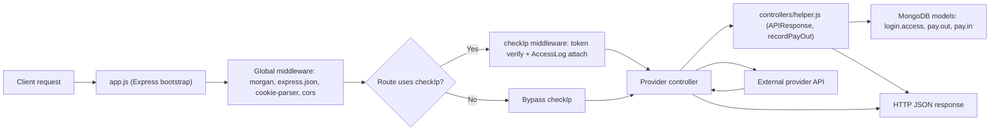

# Payment Gateway Developer Handbook

This document is the implementation-facing handbook for the payment gateway in this repository.

Service runtime location: `/Users/kunanonjarat/Desktop/GoGoCash/App Development/payment-main/payment`  
Documentation location: `/Users/kunanonjarat/Desktop/GoGoCash/App Development/payment-main/README.md`

## Table of Contents

1. [System Purpose](#1-system-purpose)
2. [Architecture At A Glance](#2-architecture-at-a-glance)
3. [Codebase Map](#3-codebase-map)
4. [Request Lifecycle (Step-by-Step)](#4-request-lifecycle-step-by-step)
5. [Authentication and Authorization Matrix](#5-authentication-and-authorization-matrix)
6. [Controller Deep-Dive](#6-controller-deep-dive)
7. [Data Layer and Logging](#7-data-layer-and-logging)
8. [Configuration Handbook](#8-configuration-handbook)
9. [Error Handling and Response Contract](#9-error-handling-and-response-contract)
10. [Known Technical Debt (As-Is)](#10-known-technical-debt-as-is)
11. [Development Workflow](#11-development-workflow)
12. [How To Add A New Provider](#12-how-to-add-a-new-provider)
13. [Acceptance Scenarios](#13-acceptance-scenarios)

## 1. System Purpose

This service is an Express-based multi-provider payment gateway for MyCashback use cases.

Primary responsibilities:

- payout disbursement (`PayPal`, `IMKAS`, `TnG`, `OnePay`)
- top-up flow (`TrueMoney`, `IMKAS`)
- points transfer (`AIS`, `Rabbit Rewards`, `NTL` point earn)
- push notification dispatch (`3BB`, `NTL`)
- request/access logging and payout persistence in MongoDB

Technology stack in current code:

- Node.js + Express
- MongoDB via Mongoose
- HTTP integrations via `axios` and `request`
- Firebase Admin SDK (Firestore for currency conversion in PayPal flow)
- XML/SOAP parsing via `xml2js` for TrueMoney
- RSA/HMAC signing for TnG, IMKAS, OnePay

## 2. Architecture At A Glance



### What Is Centralized vs Provider-Specific

Centralized:

- app bootstrap and route mounting in `payment/app.js`
- shared auth gate (`checkIp`) for selected route groups
- shared response/log helper in `payment/controllers/helper.js`
- shared Mongoose models in `payment/models/*`

Provider-specific:

- each integration controller in `payment/controllers/*.js`
- provider request signing logic (TnG/IMKAS/OnePay)
- provider payload translation and error mapping

## 3. Codebase Map

### Root-level structure

- `README.md`: this handbook
- `payment/`: executable service code

### Runtime code map

| Path | Responsibility | Coupling |
| --- | --- | --- |
| `payment/app.js` | Initializes Express middleware, Mongo/Firebase clients, shared auth middleware, route mounting | Depends on all controllers, log model, env vars, local Firebase key |
| `payment/bin/www` | Loads dotenv, creates HTTP server, binds port, process-level listener errors | Depends on `app.js`, env `PORT` |
| `payment/controllers/helper.js` | Shared `APIResponse`, `recordPayOut`, `recordPayIn` wrappers | Depends on payout/payin models and `req.session.accessLog` convention |
| `payment/controllers/paypal.js` | PayPal payout flow + Firestore FX conversion + payout persistence | Depends on `paypal-rest-sdk`, Firebase, helper, payout model via helper |
| `payment/controllers/truemoney.js` | SOAP verify/notify top-up flow + XML parsing + payout persistence | Depends on `request`, `xml2js`, helper |
| `payment/controllers/rabbitrewards.js` | Partner auth, member binding lookup, points transaction, payout persistence | Depends on `request`, async waterfall, helper |
| `payment/controllers/imkas.js` | IMKAS inquiry/topup with custom HMAC signature | Depends on `axios`, `crypto` |
| `payment/controllers/onepay.js` | OnePay transaction/query/status/prefunding with request hash | Depends on `axios`, `crypto`, helper |
| `payment/controllers/ais.js` | AIS OAuth middleware + point operations | Depends on `axios`, helper |
| `payment/controllers/tng.js` | TnG OAuth/disbursement routes + RSA signatures | Depends on `axios`, `jsrsasign`, helper/signature helper |
| `payment/controllers/ntl.js` | NTL profile proxy + point earn endpoint | Depends on `axios`, helper |
| `payment/controllers/notification.js` | Notification dispatch by publisher ID (3BB/NTL) | Depends on `axios`, helper |
| `payment/helper/generate-signature.js` | TnG request-signature helper for specific OAuth-style paths | Depends on `jsrsasign`, env private key |
| `payment/models/log.acess.js` | Access log schema (`login.access`) | Used by `checkIp` + `Helper.APIResponse` |
| `payment/models/payout.js` | Payout schema (`pay.out`) | Used through `Helper.recordPayOut` |
| `payment/models/payin.js` | Pay-in schema (`pay.in`) | Intended for inbound payment records |

## 4. Request Lifecycle (Step-by-Step)

### Startup lifecycle

1. `payment/bin/www` loads `.env` with `dotenv` (inside try/catch).
2. `payment/app.js` initializes Express middleware.
3. `mongoose.connect(MONGODB_URI)` is executed.
4. Firebase Admin is initialized using local file `payment/serviceAccountKey.json`.
5. Route groups are mounted to controllers.
6. Catch-all route `/**` returns 403 JSON for unknown routes.

### Runtime request lifecycle

1. Request enters Express app.
2. Global middleware executes in order:
   - `morgan('dev')`
   - `express.json()`
   - `cookieParser()`
   - `cors()`
3. Route matching determines controller and whether `checkIp` runs first.
4. For guarded routes:
   - `checkIp` reads `req.headers.token`
   - compares to static literal token
   - attaches `req.session.accessLog` with request params/query/body
5. Controller executes provider-specific logic.
6. Response is returned either:
   - directly with `res.json(...)`, or
   - via `Helper.APIResponse(req, res, error, data)`
7. If `Helper.APIResponse` is used and `req.session.accessLog` exists, response data is persisted to Mongo access log.

### `Helper.APIResponse` behavior

`Helper.APIResponse` does two things:

- writes `resData` into `req.session.accessLog` and saves log document
- returns JSON with status `200` (no error) or `400` (error)

Contract:

```json
{
  "success": true,
  "error": null,
  "data": {}
}
```

## 5. Authentication and Authorization Matrix

### Route-group auth gate

| Base Route | Controller | `checkIp` applied at `app.js` | Current gate input |
| --- | --- | --- | --- |
| `/notification/*` | `controllers/notification.js` | Yes | Header `token` must match static literal in `app.js` |
| `/paypal/*` | `controllers/paypal.js` | Yes | Header `token` |
| `/truemoney/*` | `controllers/truemoney.js` | Yes | Header `token` |
| `/rabbitrewards/*` | `controllers/rabbitrewards.js` | Yes | Header `token` |
| `/imkas/*` | `controllers/imkas.js` | Yes | Header `token` |
| `/ntl/*` | `controllers/ntl.js` | Yes | Header `token` |
| `/ais/*` | `controllers/ais.js` | No | Per-request AIS OAuth middleware (`client_id/client_secret`) |
| `/tng/*` | `controllers/tng.js` | No | Route-specific TnG auth via `authCode` or `accessToken` |
| `/onepay/*` | `controllers/onepay.js` | No | Signature/hash validation with OnePay secret |

### Provider-level auth inputs

| Provider | Key request auth input | Additional auth source |
| --- | --- | --- |
| Shared guarded routes | `token` header | Static token literal in `app.js` |
| AIS | none from caller for OAuth route setup (uses env credentials) | `AIS_CLIENT_ID`, `AIS_CLIENT_SECRET`, `AIS_GRANT_TYPE` |
| TnG | `authCode` or `accessToken` in body for selected routes | RSA signatures and client credentials |
| OnePay | business fields in body, hash computed server-side | `ONEPAY_SECRET_KEY` |
| NTL profile | `token` in query string (`/ntl/profile`) | forwarded as Bearer token to NTL API |

## 6. Controller Deep-Dive

### 6.1 `controllers/paypal.js`

Purpose:

- payout to PayPal email
- optional currency conversion from Firestore daily rates
- payout record creation in Mongo

Endpoints:

- `POST /paypal/payout`

Required request fields:

- `customerId`
- `email`
- `amount`
- `currency`

Optional fields:

- `note`
- `paymentId`

External dependencies:

- `paypal-rest-sdk`
- Firebase Firestore (`currencies/{YYYYMMDD}`)

Internal flow:

1. Validate required fields.
2. If currency is not USD, query Firestore to convert to USD.
3. Call `singlePayout` using PayPal SDK.
4. Persist payout via `Helper.recordPayOut`.
5. Return direct JSON (`res.json`) in waterfall callback.

Response pattern:

- direct JSON shape `{ success, error, data }`

Persistence side effects:

- writes one `pay.out` document on payout persistence step

### 6.2 `controllers/truemoney.js`

Purpose:

- TrueMoney SOAP top-up with two-stage verify/notify sequence

Endpoints:

- `POST /truemoney/topup`

Required request fields:

- `userId`
- `phoneNo`
- `amount`

External dependencies:

- SOAP endpoint via `TMN_TOPUP_BASE_URL`
- `request` for HTTP
- `xml2js` for SOAP/XML parsing

Internal flow:

1. Build verify SOAP XML (`getRequestBody('verify', ...)`).
2. Send verify request to TrueMoney endpoint.
3. Parse XML and inspect `rsp_code`.
4. If verify success (`rsp_code === "0"`), build notify SOAP XML and send.
5. Parse notify response and persist payout with `Helper.recordPayOut`.
6. Return localized Thai failure messages for known response codes.

Response pattern:

- direct JSON with `success`, optional `code`, `message`, and `data`

Persistence side effects:

- writes `pay.out` after notify success path

### 6.3 `controllers/rabbitrewards.js`

Purpose:

- Rabbit Rewards points transfer for a bound member

Endpoints:

- `POST /rabbitrewards/send-points`

Required request fields:

- `sso`
- `amount`

External dependencies:

- Rabbit partner APIs (`/access_token`, `/get_binding`, `/transaction`)
- `request`, `async.waterfall`, `append-query`

Internal flow:

1. Validate `sso` and `amount`.
2. Authenticate partner and store token in module-scoped object.
3. Fetch member binding by `sso`.
4. Transfer points using bound member ID.
5. Persist payout record (`type: RR-POINT`) via `recordPayOut`.

Response pattern:

- validation failures use `Helper.APIResponse`
- final waterfall completion uses direct `res.json`

Persistence side effects:

- writes `pay.out` on successful transaction stage

### 6.4 `controllers/imkas.js`

Purpose:

- IMKAS inquiry and top-up (posting disbursement)

Endpoints:

- `POST /imkas/inquiry`
- `POST /imkas/topup`

Required request fields:

- `timestamp`
- `amount`
- `phoneNumber`

Optional fields:

- `description`

External dependencies:

- IMKAS API endpoints
- custom HMAC-SHA256 signature generation (`getSignature`)

Internal flow:

1. Validate mandatory fields.
2. Build JSON payload with partner metadata and reference numbers.
3. Normalize payload string and generate signature.
4. Send request with `Institution-ID`, `Authorization`, `signature`, `timestamp` headers.
5. Return response with success/failure mapping from provider `responseCode`.

Response pattern:

- direct JSON
- includes `request` echo and `error/data` payloads

Persistence side effects:

- no Mongo write in current implementation

### 6.5 `controllers/onepay.js`

Purpose:

- OnePay transaction operations with hash signing

Endpoints:

- `POST /onepay/transactionInquery`
- `POST /onepay/transaction`
- `POST /onepay/checkTransactionStatus`
- `POST /onepay/checkPrefunding`

Required request fields by endpoint:

- `transactionInquery`: `subAgentID`, `sequenceNo`, `receiverNo`, `amount`
- `transaction`: `subAgentID`, `sequenceNo`, `receiverNo`, `amount`
- `checkTransactionStatus`: `subAgentID`, `sequenceNo`
- `checkPrefunding`: `subAgentID`

External dependencies:

- OnePay HTTP endpoints
- HMAC-SHA1 hash with `ONEPAY_SECRET_KEY`

Internal flow:

1. Build request body object.
2. Concatenate body values (`concatBodyValue`) in key iteration order.
3. Compute hash and append `HashValue`.
4. POST to configured OnePay endpoint.
5. Return via `Helper.APIResponse`.

Response pattern:

- standardized helper envelope + status code 200/400

Persistence side effects:

- no payout/payin write in current implementation

### 6.6 `controllers/ais.js`

Purpose:

- AIS point checks, transfers, and reversals

Endpoints:

- `POST /ais/checkTransferPoint`
- `POST /ais/pointTransferIn`
- `POST /ais/reversePointTransferIn`

Required request fields:

- `checkTransferPoint`: `transactionID`, `msisdn`, `points`
- `pointTransferIn`: `transactionID`, `msisdn`, `points`
- `reversePointTransferIn`: `msisdn`, `transactionID`

External dependencies:

- AIS OAuth endpoint (`AIS_PATH_AUTHEN`)
- AIS operation endpoints (`AIS_PATH_*`)

Internal flow:

1. Middleware `authentication` requests OAuth token using env credentials.
2. Token response is attached as `req.body.auth`.
3. Endpoint handler checks auth presence.
4. Handler sends provider-specific payload with AIS username/password plus request fields.
5. Response returns via `Helper.APIResponse`.

Response pattern:

- helper envelope
- auth failure often returned as success=false with message payload

Persistence side effects:

- no payout/payin write in current implementation

### 6.7 `controllers/tng.js`

Purpose:

- Touch 'n Go OAuth lifecycle and direct disbursement flows

Endpoints:

- `POST /tng/alipayplusOauthAccesstokenApply`
- `POST /tng/alipayplusOauthPrepareHtmPost`
- `POST /tng/alipayplusOauthAccesstokenRevokeHtmPost`
- `POST /tng/alipayplusDisbursementDirectHtmPost`

Required request fields by endpoint:

- `alipayplusOauthAccesstokenApply`: either `accessToken` or `authCode`
- `alipayplusOauthPrepareHtmPost`: `authState` typically required by caller flow
- `alipayplusOauthAccesstokenRevokeHtmPost`: `accessToken`
- `alipayplusDisbursementDirectHtmPost`: `partnerTransId`, `amountMYR`, and auth context (`authCode` or `accessToken`)

External dependencies:

- TnG API endpoints and function codes
- RSA signatures through two mechanisms:
  - `payment/helper/generate-signature.js` for OAuth-style signed headers
  - local `genSig` for request envelope signature fields

Internal flow:

1. Optional middleware authentication obtains access token from auth code.
2. Request payload assembled with headers/body per TnG contract.
3. Signature generated and attached.
4. Provider call via axios.
5. Return through `Helper.APIResponse`.

Response pattern:

- helper envelope with wrapped provider response object

Persistence side effects:

- no payout/payin write in current implementation

### 6.8 `controllers/ntl.js`

Purpose:

- NTL profile proxy and point earn integration

Endpoints:

- `GET /ntl/profile`
- `POST /ntl/point/earn`

Required request fields:

- `/ntl/profile`: query `token`
- `/ntl/point/earn`: body `reqId`, `refId`, `points`

External dependencies:

- `NTL_BASE_URL` profile endpoint
- `NTL_CHOCCO_BASE_URL` point earn endpoint

Internal flow:

1. Validate profile token (query parameter).
2. Proxy profile call with Bearer token header.
3. For point earn, map request fields and send event payload with current datetime.
4. Return via `Helper.APIResponse`.

Response pattern:

- helper envelope

Persistence side effects:

- no payout/payin write in current implementation

### 6.9 `controllers/notification.js`

Purpose:

- dispatch push notifications to provider-specific APIs based on publisher ID

Endpoints:

- `ALL /notification/send`

Accepted request fields (query or body):

- `publisherId`
- `buyerIds` or `buyerId`
- `title`
- `message`
- `url` (optional)

External dependencies:

- 3BB endpoint (`TBB_BASE_URL`)
- NTL endpoint (`NTL_BASE_URL`)

Internal flow:

1. Read fields from query first, then body fallback.
2. Switch by publisher ID.
3. Call either `send3bbNotification` or `sendNTLNotification`.
4. Return through `Helper.APIResponse`.

Response pattern:

- helper envelope on known publisher IDs

Persistence side effects:

- no payout/payin write in current implementation

## 7. Data Layer and Logging

### Models

| Model file | Mongoose model name | Purpose | Key fields |
| --- | --- | --- | --- |
| `payment/models/log.acess.js` | `login.access` | API request/response auditing | `ip`, `reqData`, `resData`, timestamps |
| `payment/models/payout.js` | `pay.out` | Outgoing disbursement records | `senderId`, `receiverId`, `type`, `amount`, `fee`, `currency`, `completedAt`, `metadata` |
| `payment/models/payin.js` | `pay.in` | Intended incoming payment records | `from`, `type`, `amount`, `currency`, `metadata` |

### Actual write paths in current code

| Write action | Trigger location |
| --- | --- |
| Access log create (in-memory on request) | `checkIp` middleware in `payment/app.js` |
| Access log save (with response data) | `Helper.APIResponse` |
| `pay.out` insert | `paypal.js`, `truemoney.js`, `rabbitrewards.js` via `Helper.recordPayOut` |
| `pay.in` insert | helper has function, but not currently called by controllers |

### Logging behavior details

- Access log capture only exists for routes guarded by `checkIp`.
- Routes not using `checkIp` do not have `req.session.accessLog` attached.
- If those routes still call `Helper.APIResponse`, no access-log save happens because session object is absent.

## 8. Configuration Handbook

This section documents variables read by the running code.

### 8.1 Core runtime

| Variable | Required | Used in | Purpose |
| --- | --- | --- | --- |
| `PORT` | No (default `3000`) | `payment/bin/www`, `payment/app.js` | HTTP listener port |
| `NODE_ENV` | Yes | `payment/app.js` | Environment mode logging/use |
| `MONGODB_URI` | Yes | `payment/app.js` | MongoDB connection string |

### 8.2 Firebase

| Config | Required | Used in | Purpose |
| --- | --- | --- | --- |
| `payment/serviceAccountKey.json` | Yes (current code path) | `payment/app.js` | Firebase Admin credential |
| hardcoded `databaseURL` | Yes | `payment/app.js` | Firebase project DB URL |

### 8.3 Shared auth / gateway behavior

| Config | Required | Used in | Purpose |
| --- | --- | --- | --- |
| static token literal in code | Yes for guarded routes | `payment/app.js` | `checkIp` gate for selected route groups |

### 8.4 PayPal

| Variable | Required | Used in |
| --- | --- | --- |
| `PAYPAL_MODE` | Yes | `controllers/paypal.js` |
| `PAYPAL_CLIENT_ID` | Yes | `controllers/paypal.js` |
| `PAYPAL_SECRET` | Yes | `controllers/paypal.js` |

### 8.5 TrueMoney

| Variable | Required | Used in |
| --- | --- | --- |
| `TMN_TOPUP_BASE_URL` | Yes | `controllers/truemoney.js` |
| `TMN_CPG_MERCHANT_ID` | Yes | `controllers/truemoney.js` |
| `TMN_CPG_PASSWORD` | Yes | `controllers/truemoney.js` |
| `TMN_BANK_CODE` | Yes | `controllers/truemoney.js` |
| `TMN_SERVICE_CODE` | Yes | `controllers/truemoney.js` |

### 8.6 Rabbit Rewards

| Variable | Required | Used in |
| --- | --- | --- |
| `RR_BASE_URL` | Yes | `controllers/rabbitrewards.js` |
| `RR_PARTNER_ID` | Yes | `controllers/rabbitrewards.js` |
| `RR_PARTNER_SECRET` | Yes | `controllers/rabbitrewards.js` |

### 8.7 IMKAS

| Variable | Required | Used in |
| --- | --- | --- |
| `IMKAS_BASE_URL` | Yes | `controllers/imkas.js` |
| `IMKAS_PARTNER_ID` | Yes | `controllers/imkas.js` |
| `IMKAS_PARTNER_SECRET` | Yes | `controllers/imkas.js` |

### 8.8 AIS

| Variable | Required | Used in |
| --- | --- | --- |
| `AIS_BASE_URL` | Yes | `controllers/ais.js` |
| `AIS_CLIENT_ID` | Yes | `controllers/ais.js` |
| `AIS_CLIENT_SECRET` | Yes | `controllers/ais.js` |
| `AIS_GRANT_TYPE` | Yes | `controllers/ais.js` |
| `AIS_PATH_AUTHEN` | Yes | `controllers/ais.js` |
| `AIS_PATH_CHECK_TRANSFER_POINT` | Yes | `controllers/ais.js` |
| `AIS_PATH_POINT_TRANSFER_IN` | Yes | `controllers/ais.js` |
| `AIS_PATH_REVERSE_POINT_TRANSFER_IN` | Yes | `controllers/ais.js` |
| `AIS_USERNAME` | Yes | `controllers/ais.js` |
| `AIS_PASSWORD` | Yes | `controllers/ais.js` |
| `AIS_IP_ADDRESS` | Yes | `controllers/ais.js` |
| `AIS_REFERENCE_CODE` | Yes | `controllers/ais.js` |

### 8.9 TnG

| Variable | Required | Used in |
| --- | --- | --- |
| `TNGD_ENDPOINT` | Yes | `controllers/tng.js` |
| `TNGD_VERSION` | Yes | `controllers/tng.js` |
| `TNGD_CLIENT_ID` | Yes | `controllers/tng.js` |
| `TNGD_CLIENT_SECRET` | Yes | `controllers/tng.js` |
| `TNGD_PARTNER_ID` | Yes | `controllers/tng.js` |
| `TNGD_PRODUCT_CODE` | Yes | `controllers/tng.js` |
| `TNGD_PRIVATE_KEY` | Yes | `controllers/tng.js`, `helper/generate-signature.js` |
| `TNGD_AUTH_CLIENT_DISPLAY_NAME` | Yes | `controllers/tng.js` |
| `TNGD_AUTH_REDIRECT_URL` | Yes | `controllers/tng.js` |
| `TNGD_AUTH_LOGO_URL` | Yes | `controllers/tng.js` |
| `TNGD_PATH_ACCESS_TOKEN_APPLY` | Yes | `controllers/tng.js` |
| `TNGD_PATH_OAUTH_PREPARE` | Yes | `controllers/tng.js` |
| `TNGD_PATH_ACCESS_TOKEN_REVOKE` | Yes | `controllers/tng.js` |
| `TNGD_PATH_ACCESS_DISBURSEMENT_DIRECT` | Yes | `controllers/tng.js` |
| `TNGD_FUNC_OAUTH_ACCESSTOKEN_REVOKE` | Yes | `controllers/tng.js` |
| `TNGD_FUNC_DISBURSEMENT_DIRECT` | Yes | `controllers/tng.js` |

### 8.10 OnePay

| Variable | Required | Used in |
| --- | --- | --- |
| `ONEPAY_ENDPOINT` | Yes | `controllers/onepay.js` |
| `ONEPAY_SECRET_KEY` | Yes | `controllers/onepay.js` |
| `ONEPAY_AGENT_ID` | Yes | `controllers/onepay.js` |
| `ONEPAY_INVOICE_NO` | Yes (in inquiry route) | `controllers/onepay.js` |
| `ONEPAY_EXPIRED_SECONDS` | Yes (in inquiry route) | `controllers/onepay.js` |
| `ONEPAY_DATE_TIME_FORMAT` | Yes | `controllers/onepay.js` |
| `ONEPAY_PATH_TRANSACTION_INQUERY` | Yes | `controllers/onepay.js` |
| `ONEPAY_PATH_TRANSACTION` | Yes | `controllers/onepay.js` |
| `ONEPAY_PATH_CHECK_TRANSACTION_STATUS` | Yes | `controllers/onepay.js` |
| `ONEPAY_PATH_CHECK_PREFUNDING` | Yes | `controllers/onepay.js` |

### 8.11 NTL and Notifications

| Variable | Required | Used in |
| --- | --- | --- |
| `NTL_BASE_URL` | Yes | `controllers/ntl.js`, `controllers/notification.js` |
| `NTL_BASE_TOKEN` | Yes | `controllers/notification.js` |
| `NTL_CHOCCO_BASE_URL` | Yes | `controllers/ntl.js` |
| `NTL_CHOCCO_BASE_TOKEN` | Yes | `controllers/ntl.js` |
| `TBB_BASE_URL` | Yes | `controllers/notification.js` |

Note: `controllers/notification.js` references `TBB_BASE_TOKEN` but does not currently read it from `process.env` in that file.

## 9. Error Handling and Response Contract

### Current response patterns in code

Pattern A: direct `res.json` from controller

- Used by: `paypal`, `truemoney`, `rabbitrewards` (partly), `imkas`
- Status code often defaults to HTTP 200 regardless of success/failure body

Example shape:

```json
{
  "success": false,
  "error": {
    "message": "..."
  },
  "data": null
}
```

Pattern B: `Helper.APIResponse`

- Used by: `ais`, `onepay`, `tng`, `ntl`, `notification`, plus some validation in `rabbitrewards`
- Status code: `200` when `error == null`, else `400`

Shape:

```json
{
  "success": true,
  "error": null,
  "data": {}
}
```

Pattern C: gate/catch-all in `app.js`

- `checkIp` failure: `403` with `{ success: false, error: { message: 'Not Allow' } }`
- unmatched route: same `403` shape from catch-all `/**`

## 10. Known Technical Debt (As-Is)

Operational warnings based on current implementation:

1. Secrets are committed in repository files (`serviceAccountKey.json`, `app.yaml`, `app-dev.yaml`).
2. Shared gateway token for protected routes is static and hardcoded in `app.js`.
3. Auth coverage is inconsistent: some route groups bypass `checkIp` by design (`/ais`, `/tng`, `/onepay`).
4. `notification.js` has no default response in unknown `publisherId` branch, which can leave requests unresolved.
5. `controllers/helper.js` `recordPayIn` imports payout model and ignores input payload.
6. `notification.js` references `TBB_BASE_TOKEN` without local definition from env.
7. Mixed response patterns (`res.json` vs `Helper.APIResponse`) produce inconsistent status-code behavior.
8. Logging/sensitive payload printing exists in several controllers (`console.log` on request/config/body data).
9. No automated test suite is present in the repository.
10. Naming typos exist in API/file identifiers (for example `transactionInquery`, `log.acess`).

Recommended future refactor topics:

- unify response contract and status semantics
- centralize auth strategy by route class
- standardize provider client wrappers and error adapters
- add contract tests per controller

## 11. Development Workflow

### Local setup

1. Install dependencies:

```bash
cd payment
npm install
```

2. Create runtime env values (local `.env` for all used variables).
3. Start service:

```bash
npm run dev
```

Server entrypoint:

- `payment/bin/www` -> `payment/app.js`

### Fast debug map (where to edit)

- Route mounting and auth wiring: `payment/app.js`
- New endpoint logic for provider: `payment/controllers/<provider>.js`
- Shared response or persistence helper behavior: `payment/controllers/helper.js`
- Data schema changes: `payment/models/*.js`
- TnG request signature: `payment/helper/generate-signature.js`

### Smoke test checklist

1. Verify protected route rejects missing token:

```bash
curl -i -X POST http://localhost:3000/paypal/payout -H 'Content-Type: application/json' -d '{}'
```

2. Verify protected route accepts configured token and reaches validation logic:

```bash
curl -i -X POST http://localhost:3000/rabbitrewards/send-points \
  -H 'Content-Type: application/json' \
  -H 'token: <configured-static-token>' \
  -d '{"sso":"demo","amount":1}'
```

3. Verify unguarded route path is reachable (behavior depends on provider config):

```bash
curl -i -X POST http://localhost:3000/onepay/checkPrefunding \
  -H 'Content-Type: application/json' \
  -d '{"subAgentID":"demo"}'
```

4. Verify catch-all blocks unknown route:

```bash
curl -i http://localhost:3000/unknown
```

### Major endpoint quick examples

PayPal:

```bash
curl -X POST http://localhost:3000/paypal/payout \
  -H 'Content-Type: application/json' \
  -H 'token: <configured-static-token>' \
  -d '{"customerId":"u1","email":"user@example.com","amount":100,"currency":"THB"}'
```

TrueMoney:

```bash
curl -X POST http://localhost:3000/truemoney/topup \
  -H 'Content-Type: application/json' \
  -H 'token: <configured-static-token>' \
  -d '{"userId":"u1","phoneNo":"0812345678","amount":50}'
```

Rabbit Rewards:

```bash
curl -X POST http://localhost:3000/rabbitrewards/send-points \
  -H 'Content-Type: application/json' \
  -H 'token: <configured-static-token>' \
  -d '{"sso":"SSO123","amount":10}'
```

IMKAS inquiry:

```bash
curl -X POST http://localhost:3000/imkas/inquiry \
  -H 'Content-Type: application/json' \
  -H 'token: <configured-static-token>' \
  -d '{"timestamp":"20240101123000","amount":10000,"phoneNumber":"0812345678"}'
```

OnePay transaction query (legacy route name):

```bash
curl -X POST http://localhost:3000/onepay/transactionInquery \
  -H 'Content-Type: application/json' \
  -d '{"subAgentID":"SUB1","sequenceNo":"SEQ1","receiverNo":"0812345678","amount":1000}'
```

AIS transfer check:

```bash
curl -X POST http://localhost:3000/ais/checkTransferPoint \
  -H 'Content-Type: application/json' \
  -d '{"transactionID":"TX123","msisdn":"0812345678","points":100}'
```

TnG prepare OAuth:

```bash
curl -X POST http://localhost:3000/tng/alipayplusOauthPrepareHtmPost \
  -H 'Content-Type: application/json' \
  -d '{"authState":"STATE1"}'
```

NTL profile:

```bash
curl -X GET 'http://localhost:3000/ntl/profile?token=<ntl-user-token>' \
  -H 'token: <configured-static-token>'
```

Notification send:

```bash
curl -X POST 'http://localhost:3000/notification/send' \
  -H 'Content-Type: application/json' \
  -H 'token: <configured-static-token>' \
  -d '{"publisherId":"622af39f963a3c824dda9445","buyerIds":["user1"],"title":"Hello","message":"World"}'
```

## 12. How To Add A New Provider

Use this checklist to add an integration without changing unrelated modules.

### Step 1: Create controller scaffold

Create `payment/controllers/<provider>.js` with:

- Express router
- endpoint handlers
- provider request builder
- response mapping
- optional use of `Helper.APIResponse` or direct response style

### Step 2: Register route in `app.js`

Add:

```js
app.use('/<provider>/', [optional checkIp], require('./controllers/<provider>'));
```

Auth decision options:

- reuse `checkIp` for internal/trusted routes
- implement provider-specific auth middleware
- both if needed

### Step 3: Define env var contract

- enumerate required vars in controller constants
- add variables to deployment/runtime env management
- update this README configuration tables

### Step 4: Add persistence/logging behavior

Decide if the provider should:

- write payout records using `Helper.recordPayOut`
- write payin records (if implementing/fixing payin path)
- rely on access logs via `checkIp` + `Helper.APIResponse`

### Step 5: Add endpoint documentation in README

For each endpoint, add:

- purpose
- full path
- required fields
- external dependencies
- flow summary
- response style
- persistence side effects

### Step 6: Add smoke test examples

- one success-path request sample
- one validation/error-path request sample
- include whether auth header is required

### Step 7: Validate route behavior

- protected route behavior (if using `checkIp`)
- fallback `/**` behavior unchanged
- no regression to existing route groups

## 13. Acceptance Scenarios

Use these checks to verify this handbook is effective for onboarding and maintenance.

1. A new engineer can identify within 10 minutes:
   - which routes are guarded by token middleware
   - which controller to edit for each provider
   - required env vars for one selected provider
2. A maintainer can add a new provider using Section 12 without reading unrelated controllers.
3. A reviewer can trace one flow end-to-end (example: `/paypal/payout`) from route entry to external API to Mongo write.
4. Operations can map each secret/config variable to its integration from Section 8.

## Scope Note

This README is documentation-only and describes current behavior as implemented, including legacy naming and existing caveats. It does not imply runtime API changes.
