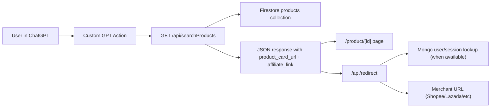

# Agentic Commerce Protocol (ACP)

Production-focused Next.js 16 backend and API surface for GoGoCash AI shopping in ChatGPT.

This README is written for engineers who need to understand the codebase quickly, change it safely, and ship without breaking ChatGPT actions.

---

## 1. What This System Does

ACP provides three core capabilities:

1. Product discovery from Firestore with Thai/English keyword handling.
2. Product detail pages (`/product/[id]`) that render image + cashback context.
3. Affiliate redirect tracking (`/api/redirect`) and user-facing cashback/profile APIs.

At runtime, ChatGPT primarily hits `/api/searchProducts`, then displays `product_card_url` and `affiliate_link` from the response.

---

## 2. High-Level Runtime Architecture



### Key architectural choice

The app uses **Next.js App Router API routes** as the main server interface. The repository also contains a legacy `src/ACP/*` service layer that some routes still re-export from.

---

## 3. Technology Stack

- Framework: `next@16.x` (App Router)
- Language: TypeScript
- Runtime: Node 20
- Product data: Firestore (`products` collection)
- User/session/cashback data: MongoDB (`users`, cashback collections)
- Hosting: Firebase Hosting + frameworks backend (Cloud Run region `asia-southeast1`)
- GPT contract: OpenAPI 3.1 in `public/openapi.yaml`

---

## 4. Repository Map (What Lives Where)

```text
app/
  layout.tsx                     Root HTML shell
  page.tsx                       Minimal status homepage
  product/[id]/page.tsx          Dynamic product detail page
  api/
    searchProducts/route.ts      Primary production search route
    image/route.ts               Shopee image proxy
    redirect/route.ts            Redirect + click logging stub
    user/profile/route.ts        Re-export -> src/ACP/api/userProfile
    user/cashback/route.ts       Re-export -> src/ACP/api/userCashback
    login/route.ts               Login/create user via db-service
    linkWallet/route.ts          Re-export -> src/ACP/api/linkWallet
    getCashback/route.ts         Re-export -> src/ACP/api/getCashback
    getGifts/route.ts            Gift search flow (Shopee service)
    unlink/route.ts              Session revocation
    check-mongo-user/route.ts    Debug endpoint using raw MongoClient
    debug-env/route.ts           Env diagnostics endpoint
    test/route.ts                Health/test endpoint

src/ACP/
  api/                           Legacy route handlers (some still active via re-export)
  services/                      Integration services (Firestore, GoGoCash API)
  lib/                           DB and transformation helpers
  scripts/                       Data ingestion/migration scripts
  config/                        Firebase/Mongo config modules
  shopee.ts / lazada.ts          Merchant adapter logic

public/
  openapi.yaml                   ChatGPT action schema

docs/
  ARCHITECTURE.md                Earlier architecture notes
  GPT_SETUP.md                   GPT instruction template
  FIRESTORE_UPLOAD_GUIDE.md      Upload pipeline docs
  PRODUCT_TRANSFORMATION.md      Product normalization details

firebase.json                    Hosting/functions/firestore deployment config
firestore.rules                  Firestore security model
next.config.ts                   Next build settings
```

---

## 5. Request Lifecycle Deep-Dive

## 5.1 Search Lifecycle (`GET /api/searchProducts`)

Implementation: `app/api/searchProducts/route.ts`

### Step A: Input parsing

- Reads query params: `query`, `user_email`, `limit`.
- `limit` defaults to `5`.

### Step B: Keyword extraction

`extractSearchKeywords()`:

- Lowercases and strips punctuation while preserving Thai (`ก-๙`).
- Removes noise words in English and Thai (e.g. `find`, `under`, `shopee`, `หา`, `ไม่เกิน`).
- Expands each term through `SYNONYMS` map (English ↔ Thai + related terms).

### Step C: Firestore query strategy

`queryFirestoreByKeyword()` and `searchFirestoreProducts()`:

- Uses Firestore REST `runQuery` against `products`.
- Query operator: `ARRAY_CONTAINS` on `keywords` field.
- Runs multiple keyword queries sequentially.
- Deduplicates by product ID.

### Step D: Ranking and filtering

- Relevance scoring uses matched keyword count + rating + sold signal.
- Price filter is parsed from free text (THB and USD patterns).
- If filter removes all hits, returns cheapest fallback subset.
- Final sort priority:
  1. relevance score desc
  2. rating desc
  3. price asc

### Step E: Response enrichment

Each product is rewritten to include:

- `image_url` proxied through `/api/image` (when Shopee URL)
- `image_url_original`
- `product_card_url` (`/product/{id}`)
- `affiliate_link` wrapped via `/api/redirect` when `user_email` is present

### Step F: Hard fallback

If no products are found, response returns one synthetic Shopee search result link with `source: "shopee_search"`.

---

## 5.2 Product Page Lifecycle (`/product/[id]`)

Implementation: `app/product/[id]/page.tsx`

- Fetches Firestore document via REST endpoint by product ID.
- Generates metadata dynamically (`generateMetadata`) for title/description/OpenGraph.
- Renders a styled product card with:
  - image
  - price
  - rating / sold
  - cashback amount
  - buy CTA linked to `/api/redirect`
- Uses `next: { revalidate: 3600 }` for hourly cache refresh.

Note: Styling is inline CSS in this file (intentional in current project style).

---

## 5.3 Redirect Lifecycle (`GET /api/redirect`)

There are two redirect implementations:

- Active App Router route: `app/api/redirect/route.ts`
- Legacy richer version: `src/ACP/api/redirect.ts` (used in older flow)

Current app route:

- Validates `url` query param.
- Decodes and performs `302` redirect.
- Emits simple click log.

Legacy route includes additional `sub_id` injection using session/user lookup. Keep this distinction in mind when extending attribution behavior.

---

## 5.4 Profile/Cashback/Auth Lifecycle

### User profile

- Route: `app/api/user/profile/route.ts`
- Re-export to `src/ACP/api/userProfile.ts`
- Requires `user_email` query.
- Adds permissive CORS headers for GPT action compatibility.

### User cashback

- Route: `app/api/user/cashback/route.ts`
- Re-export to `src/ACP/api/userCashback.ts`
- Legacy implementation expects session token in header/query.

### Login

- Route: `app/api/login/route.ts`
- Uses `db-service` abstraction.
- Validates email/phone format.
- Find-or-create user, create session, return token + user summary.

### Link wallet / get cashback

- Routes are currently re-exported from legacy `src/ACP/api/*` modules.
- Behavior is mixed between mock and DB-backed flows depending on module.

---

## 6. API Route Reference (Current Code)

| Route | Method | Source of Truth | Data Source | Notes |
|---|---|---|---|---|
| `/api/searchProducts` | GET | `app/api/searchProducts/route.ts` | Firestore REST | Main production search path |
| `/api/image` | GET | `app/api/image/route.ts` | External Shopee CDN | Domain allowlist enforced |
| `/api/redirect` | GET | `app/api/redirect/route.ts` | None (decode + redirect) | Minimal tracking currently |
| `/api/user/profile` | GET | `src/ACP/api/userProfile.ts` | GoGoCash API bridge | Requires `user_email` |
| `/api/user/cashback` | GET | `src/ACP/api/userCashback.ts` | Session + cashback store | Legacy token model |
| `/api/login` | POST | `app/api/login/route.ts` | Mongo via db service | Email/phone auth |
| `/api/linkWallet` | POST | `src/ACP/api/linkWallet.ts` | legacy/mock db module | Re-exported |
| `/api/getCashback` | GET | `src/ACP/api/getCashback.ts` | session + mocked summary | Re-exported |
| `/api/getGifts` | GET | `app/api/getGifts/route.ts` | Shopee service (+ optional auth) | Gift search helper |
| `/api/unlink` | POST | `app/api/unlink/route.ts` | session service | Revokes token |
| `/api/check-mongo-user` | GET | `app/api/check-mongo-user/route.ts` | Raw MongoClient | Debug/admin endpoint |
| `/api/debug-env` | GET | `app/api/debug-env/route.ts` | Process env | Diagnostics |
| `/api/test` | GET/OPTIONS | `app/api/test/route.ts` | None | Health check |

---

## 7. Data Model

## 7.1 Firestore (`products`)

Primary fields used by runtime search and product page:

```ts
{
  title: string;
  price: number;
  image_url: string;
  product_url: string;
  rating: number;
  sold: number;
  keywords: string[];
  shopid?: string;
  itemid?: string;
}
```

Enhanced ingestion scripts in `src/ACP/scripts/` may also add:

- `display_title`, `clean_title`, `search_text`, `vector_text`
- `attributes` map (volume, category, benefits, etc.)

## 7.2 MongoDB (`users` and cashback collections)

Typical user fields referenced by API routes:

```ts
{
  email?: string;
  phone?: string;
  wallet_address?: string;
  balance: number;
  go_points: number;
  go_tier: string;
}
```

Debug cashback route also reads collection `usermycashbacks`.

---

## 8. Security and Access Model

## Firestore rules (`firestore.rules`)

- Public read is allowed for `/products/*`.
- Writes to products are denied from client rules.
- User and cashback collections are restricted.
- Catch-all default deny for everything else.

## API-level safeguards present in code

- Image proxy host allowlist to Shopee CDN domains.
- Input validation on login/email/phone.
- Basic required-param validation across routes.

## Security caveats to keep in mind

- Some debug endpoints are publicly reachable unless protected by deployment config.
- Mixed legacy vs app-layer auth patterns increase drift risk.

---

## 9. Configuration and Environment

Required `.env.local` minimum:

```bash
NEXT_PUBLIC_FIREBASE_PROJECT_ID=gogocash-acp
NEXT_PUBLIC_BASE_URL=https://gogocash-acp.web.app
MONGODB_URI=mongodb+srv://...
MONGODB_DB=gogocash
```

Common optional variables used by legacy modules:

- `MONGODB_MIGRATION_URI`
- `INVOLVE_API_KEY`
- `INVOLVE_API_SECRET`
- `FIREBASE_SERVICE_ACCOUNT_PATH`

---

## 10. Build and Deploy Architecture

## Next config (`next.config.ts`)

- `typescript.ignoreBuildErrors = true`
- This allows deploys despite TS type issues. Useful for speed, risky for regressions.

## Firebase config (`firebase.json`)

- Hosting source: project root.
- Frameworks backend enabled (Cloud Run region `asia-southeast1`).
- Firestore rules deployment configured.
- Functions codebase (`functions/`) also configured with predeploy build.

Deployment commands:

```bash
npm run build
firebase deploy --only hosting
firebase deploy --only firestore:rules
```

---

## 11. ChatGPT Integration Contract

- OpenAPI schema file: `public/openapi.yaml`
- GPT instruction template: `docs/GPT_SETUP.md`

When API response fields change:

1. update route handler
2. update `public/openapi.yaml`
3. update `docs/GPT_SETUP.md` if prompt formatting assumptions changed
4. redeploy hosting

---

## 12. Operational Scripts and Data Pipelines

Most ingestion/migration logic lives under `src/ACP/scripts/` and `docs/*GUIDE*.md`.

Common script families:

- CSV feed processing and upload
- transformation and keyword generation
- migration/checkpoint workflows
- verification scripts for search/auth/cloud connectivity

Start with:

- `docs/FIRESTORE_UPLOAD_GUIDE.md`
- `docs/PRODUCT_TRANSFORMATION.md`
- `docs/UPDATE_PRODUCT_FEED.md`

---

## 13. Fast Development Playbooks

## Add new search synonym

1. Edit `SYNONYMS` in `app/api/searchProducts/route.ts`.
2. Keep entries bilingual where possible.
3. Test query via cURL.

## Add new API endpoint

1. Create `app/api/<name>/route.ts`.
2. Add OpenAPI schema in `public/openapi.yaml`.
3. Document endpoint behavior in README.

## Change product response schema

1. Update `app/api/searchProducts/route.ts` mapping.
2. Update OpenAPI spec.
3. Update GPT formatting instructions (`docs/GPT_SETUP.md`).

## Change product page rendering

1. Edit `app/product/[id]/page.tsx`.
2. Validate SSR metadata and image rendering.
3. Confirm buy link still routes through `/api/redirect`.

---

## 14. Testing and Verification

Quick checks:

```bash
npm run dev
npm run build
curl "https://gogocash-acp.web.app/api/searchProducts?query=keyboard&limit=3"
curl "https://gogocash-acp.web.app/api/user/profile?user_email=test@example.com"
```

If behavior differs between local and deployed:

- verify env vars
- verify Firestore rules deployed
- verify OpenAPI schema is current
- verify legacy re-export routes still point to intended handlers

---

## 15. Current Technical Debt (Important)

1. Mixed architecture: some routes are App-layer native, others re-export legacy `src/ACP/api` handlers.
2. Auth patterns vary by route (email-based, session-token-based, optional auth).
3. `next.config.ts` ignores TS build errors, which can mask runtime bugs.
4. Multiple debug/admin-like endpoints exist under `app/api/*` and should be gated before strict production hardening.

---

## 16. Canonical Links

- Live API base: `https://gogocash-acp.web.app/api`
- OpenAPI schema: `https://gogocash-acp.web.app/openapi.yaml`
- Sample product page: `https://gogocash-acp.web.app/product/10048433388`
- Firebase console: `https://console.firebase.google.com/project/gogocash-acp`
- GitHub: `https://github.com/mygogocash/Agentic-Commerce-Protocol`

